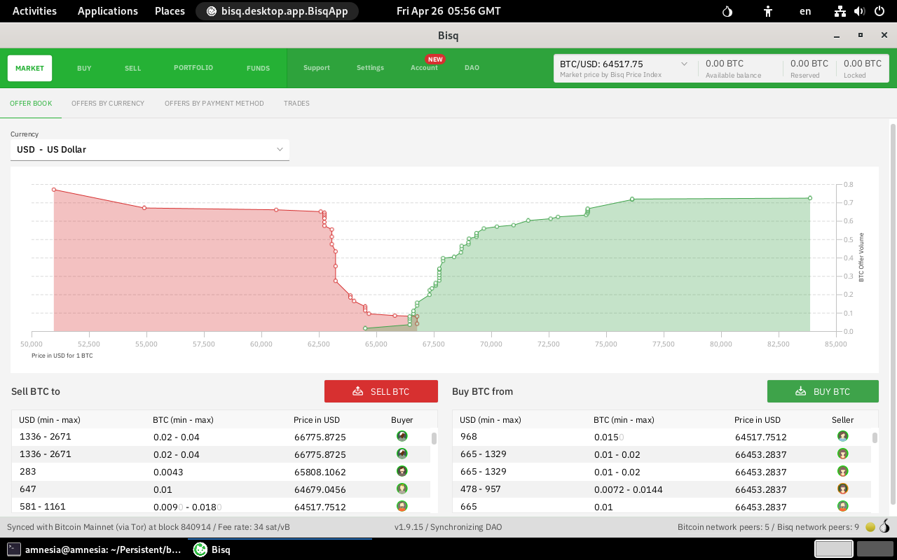

## Bisq
{: .no_toc }

## Table of contents
{: .no_toc .text-delta }

1. TOC
   {:toc}

---
### Overview

[Bisq] is and open-source desktop software, Bisq provides a peer to peer bitcoin exchange experience. Buy and sell bitcoin for fiat (or other cryptocurrencies) privately and securely using Bisq's peer-to-peer network.



{: .note }
Bisq Data directory is relocated to the Persistent Storage, so that your wallet, keys, etc. are not lost every time Tails shuts down.  


---
### Install Bisq

* Make sure **Tails Autostart** utility has been installed. See [Tails Autostart].


* Open a _Terminal_ window:  choose **Applications ▸ Utilities ▸ Terminal**


* Clone Run-on-Tails GitHub repository:
```shell
$ cd ~/Downloads
$ git clone https://github.com/dutu/run-on-tails.git
```


* Setup Bisq installation:
  ```shell
  $ chmod +x ./run-on-tails/bisq/config-installation.sh 
  $ ./run-on-tails/flatpak/config-installation.sh 
  ```
  * Wait for the message `Bisq installation setup completed successfully.`


---
### How to use it

  * Choose **Applications ▸ Other ▸ Bisq**

  {: .note }
  Bisq Data directory is relocated to the Persistent Storage, so that your wallet, keys, etc. are not lost every time Tails shuts down.  
  On the other hand, Bisq application installation is done entirely in memory. Therefore, Bisq must be reinstalled after every boot.
  The installation is done automatically when you launch Bisq through the desktop menu icon.

---
### Remove Bisq

* Open a _Terminal_ window:  choose **Applications ▸ Utilities ▸ Terminal**


* Remove persistent configuration:
  ```shell
  $ dotfiles_dir="/live/persistence/TailsData_unlocked/dotfiles"
  $ rm $dotfiles_dir/.config/autostart/amnesia.d/flatpak-setup-persistent-apps.sh
  $ persistence_dir="/home/amnesia/Persistent"
  $ rm -fr $persistence_dir/flatpak/utils 
  ```

* Remove flatpak package:
  ```shell
  $ sudo apt remove flatpak
  ```

---
[Bisq]: https://bisq.network/
[Tails Autostart]: ../tails-autostart/tails-autostart.html
