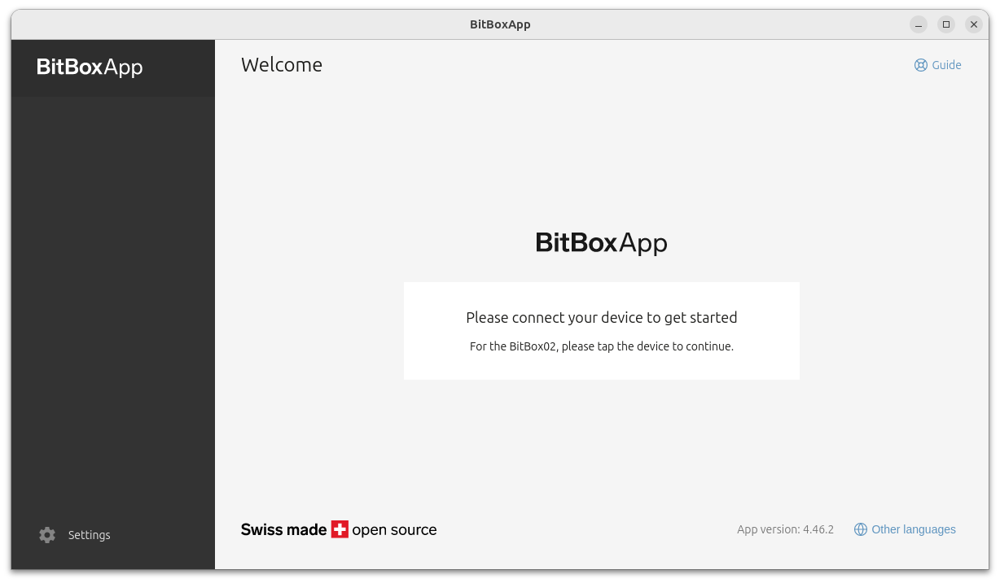

## BitBoxApp
{: .no_toc }

## Table of contents
{: .no_toc .text-delta }

1. TOC
{:toc}


---
### Overview

[BitBoxApp] is the official open source companion app for the BitBox02 hardware wallet.

{: .note }
The BitBox02 hardware wallet can also be used with several common software wallets (eg. Sparrow, Electrum, ...). The BitBoxApp is released as open source software by the vendor of the hardware wallet.




---
### Install the latest version of the BitBoxApp

* Open a _Console_:  choose **Apps ▸ System Tools ▸ Console**

* Clone Run-on-Tails GitHub repository:
```shell
$ cd ~/Downloads
$ git clone https://github.com/dutu/run-on-tails.git
```

* Setup BitBoxApp:
```shell
$ chmod +x ./run-on-tails/bitbox/setup-installation.sh 
$ ./run-on-tails/bitbox/setup-installation.sh 
```
  * Wait for the message `"BitBoxApp v X.yy.zz installation setup completed successfully."`

 ---
### How to use it

* Choose **Applications ▸ Other ▸ BitBox**

{: .note }
If you use a public server, set Proxy URL to `127.0.0.1:9050`.

---
### Backup your wallet

* While BitBoxApp is closed, copy your BitBoxApp configuration directory located at `/home/amnesia/bitbox/conf` to a backup location.


---
### Remove the currently installed version of BitBoxApp

If you want to remove a currently installed version of the BitBoxApp (eg. in case of a clean new install)

* Open a _Console_:  choose **Apps ▸ System Tools ▸ Console**

* Remove BitBoxApp application files:
  ```shell
  $ cd /home/amnesia/Persistent/bitbox && rm -r !("conf")
  ```
  
{: .important }
The BitBoxApp conf directory which contains wallet and configuration files is not deleted.
It is located at `/home/amnesia/bitbox/conf`

---
> Last tested: BitBoxApp 4.49.0 on Tails 7.3.1

---
[BitBoxApp]: https://bitbox.swiss/app/
