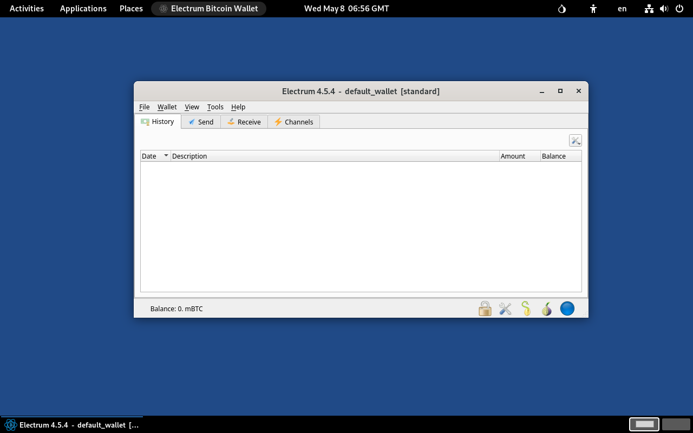

## Electrum Bitcoin Wallet
{: .no_toc }

## Table of contents
{: .no_toc .text-delta }

1. TOC
{:toc}


---
### Overview

[Electrum] is an open-source, secure, versatile Bitcoin wallet, known for its speed and simplicity. 

Electrum Bitcoin Wallet comes pre-installed on Tails, however it is not the latest version. This guide can be used to add the latest Electrum version.




---
### Install the latest version of Electrum

* [Configure the Persistent Storage] to have [Electrum Bitcoin Wallet feature] turned on:
  * Choose **Applications ▸ System Tools ▸ Persistent Storage**
  * Turn on **Electrum Bitcoin Wallet** feature
  * Close **Persistent Storage** window


* Open a _Console_:  choose **Apps ▸ System Tools ▸ Console**


* Clone Run-on-Tails GitHub repository:
```shell
$ cd ~/Downloads
$ git clone https://github.com/dutu/run-on-tails.git
```


* Setup Electrum:
  ```shell
  $ chmod +x ./run-on-tails/electrum/setup-installation.sh 
  $ ./run-on-tails/electrum/setup-installation.sh 
  ```
  * Wait for the message `Electrum installation setup completed successfully.`

---
### Update Electrum configuration file (optional)

* Edit Electrum `config` file: 
```shell
$ sudo nano ~/.electrum/config
```


{: .note }
> Example of the parameters can be added/updated:
> * `"server"` -> Specify your own Electrum server address
> * `"oneserver": true`  -> connect to one Electrum server only (it works together with parameter `server`).
> * `"auto_connect": false` -> stick with current server even if it is lagging. When `true`, every time the Electrum client receives a block header from any server, it checks if the current server is lagging, and if so, it switches to one that has the best block. "lagging" is defined to be missing at least two blocks.


{: .note }
> Example of a valid config file:
> ```json
  {
    "auto_connect": false,
    "check_updates": false,
    "config_version": 3,
    "decimal_point": 8,
    "fee_level": 3,
    "fiat_address": true,
    "history_rates": true,
    "is_maximized": false,
    "oneserver": true,
    "proxy": "socks5:localhost:9050",
    "qt_gui_color_theme": "dark",
    "server": "g4ishflgsssw5diuklqsgdb5ppsz5t2sxevysqtfpj27o5xnjbzit4qd.onion:50002:s",
    "show_addresses_tab": true,
    "show_channels_tab": true,
    "use_exchange": "Kraken",
    "use_exchange_rate": true
  }
> ```
 

 ---
### How to use it

* Choose **Applications ▸ Other ▸ Electrum**


---
### Backup your wallet

* While Electrum is closed, copy your Electrum wallet directory located at `/home/amnesia/.electrum/wallets` to a backup location.


---
### Remove the latest version of Electrum

* Open a _Console_:  choose **Apps ▸ System Tools ▸ Console**


* Remove Electrum application files:
  ```shell
  $ rm -fr /home/amnesia/Persistent/electrum
  $ rm -f /live/persistence/TailsData_unlocked/dotfiles/.local/share/applications/electrum.desktop
  ```
  
{: .important }
Electrum wallet directory located at `/home/amnesia/.electrum/wallets` is not deleted.

---
[Electrum]: https://electrum.org/
[Configure the Persistent Storage]: https://tails.net/doc/persistent_storage/configure/index.en.html
[Electrum Bitcoin Wallet feature]: https://tails.net/doc/persistent_storage/configure/index.en.html#electrum
