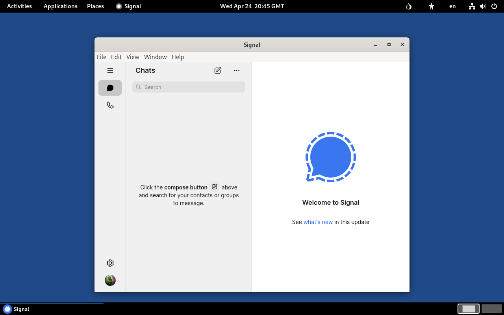

## Signal
{: .no_toc }

## Table of contents
{: .no_toc .text-delta }

1. TOC
{:toc}

---
### Overview

[Signal] is a privacy-focused messaging application that offers end-to-end encryption for secure text messages, voice calls, and video calls.



{: .note }
The application's configuration is not persistent and resets with every Tails reboot.<br>
As a result, after each reboot you need to link Signal to your account.<br>
Although possible, the process for setting up a persistent configuration isn't covered in this instruction.


---
### Install Signal

* Make sure **Flatpak** has been installed. See [Flatpak].


* Open a _Terminal_ window:  choose **Applications ▸ Utilities ▸ Terminal**


* Clone Run-on-Tails GitHub repository:
```shell
$ cd ~/Downloads
$ git clone https://github.com/dutu/run-on-tails.git
```


* Install Signal:
  ```shell
  $ torsocks flatpak install flathub org.signal.Signal
  ```


* Configure persistence:
  ```shell
  $ chmod +x ./run-on-tails/signal/config-persistence.sh 
  $ ./run-on-tails/signal/config-persistence.sh 
  ```
  * Wait for the message `Signal application setup completed successfully.`


---
### How to use it

* After Tails starts, before launching Signal, wait for the desktop message "**Additional software installed successfully**".

{: .note }
Signal application requires Flatpak package. Flatpak is installed as [additional software] automatically every time you start Tails. It may take a couple of minutes until software installation completes.


* Choose **Applications ▸ Other ▸ Signal**

---
### For the Future: Update Signal

* Open a _Terminal_ window:  choose **Applications ▸ Utilities ▸ Terminal**


* Update the application:
  ```shell
  $ torsocks flatpak update org.signal.Signal
  ```

---
### Remove Signal

* Open a _Terminal_ window:  choose **Applications ▸ Utilities ▸ Terminal**


* Remove the application, and unused runtimes and SDK extensions:
  ```shell
  $ torsocks flatpak uninstall org.signal.Signal
  $ torsocks flatpak uninstall --unused
  ```


* Remove menu entry and utility files:
  ```shell
  $ dotfiles_dir="/live/persistence/TailsData_unlocked/dotfiles"
  $ rm $dotfiles_dir/.local/share/applications/org.signal.Signal
  $ rm /home/amnesia/.local/share/applications/org.signal.Signal
  $ persistence_dir="/home/amnesia/Persistent"
  $ rm -fr $persistence_dir/org.signal.Signal
  ```
  
--- 
[Signal]: https://signal.org/
[Flatpak]: ../flatpak/flatpak.html
[additional software]: https://tails.net/doc/persistent_storage/configure/index.en.html#additional_software