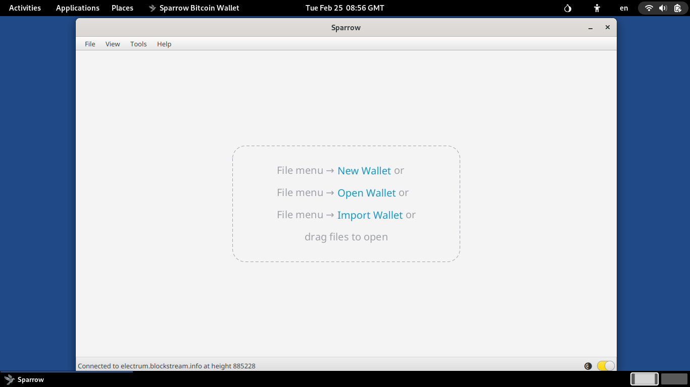

## Sparrow Bitcoin Wallet
{: .no_toc }

## Table of contents
{: .no_toc .text-delta }

1. TOC
{:toc}


---
### Overview

[Sparrow] is an open-source Bitcoin wallet focused on security, privacy, and usability. It provides detailed, user-friendly information about transactions and UTXOs, supporting financial self-sovereignty. 


---
### Install the latest version of Sparrow

* Open a _Terminal_ window:  choose **Applications ▸ Utilities ▸ Terminal**

* Clone Run-on-Tails GitHub repository:
```shell
$ cd ~/Downloads
$ git clone https://github.com/dutu/run-on-tails.git
```

* Setup Sparrow:
  ```shell
  $ chmod +x ./run-on-tails/electrum/setup-installation.sh 
  $ ./run-on-tails/electrum/setup-installation.sh 
  ```
  * Wait for the message `Sparrow installation setup completed successfully.`

 ---
### How to use it

* Choose **Applications ▸ Other ▸ Electrum**


---
### Backup your wallet

* While Sparrow is closed, copy your Sparrow wallet directory located at `/home/amnesia//Persistent/Sparrow/data/wallets` to a backup location.


---
### Remove the latest version of Sparrow

* Open a _Terminal_ window:  choose **Applications ▸ Utilities ▸ Terminal**


* Remove Sparrow application files:
  ```shell
  $ rm -fr /live/persistence/TailsData_unlocked/dotfiles/.sparrow/lib
  $ rm -fr /live/persistence/TailsData_unlocked/dotfiles/.sparrow/bin
  $ rm -f /live/persistence/TailsData_unlocked/dotfiles/.local/share/applications/sparrow.desktop
  ```
  
{: .important }
Sparrow data directory which contains wallet and configuration files is not deleted.
It is located at `/live/persistence/TailsData_unlocked/dotfiles/.sparrow/data`

---
[Sparrow]: https://www.sparrowwallet.com/
