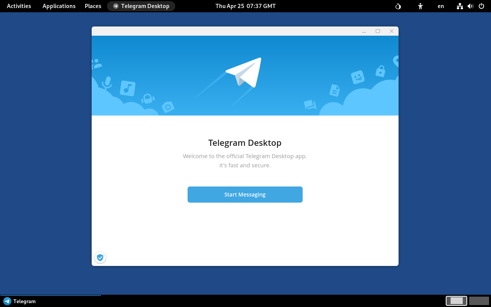

## Telegram
{: .no_toc }

## Table of contents
{: .no_toc .text-delta }

1. TOC
{:toc}

---
### Overview

[Telegram] is an instant messaging app providing voice, video, and text communications, along with secure end-to-end encrypted messaging, file sharing, and a variety of community features like groups and channels.




{: .note }
The application's configuration is not persistent and resets with every Tails reboot.<br> 
As a result, after each reboot you must set the proxy server and link Telegram to your account.<br>
Although possible, the process for setting up a persistent configuration isn't covered in this instruction.

---
### Install Telegram

* Make sure **Flatpak** has been installed. See [Flatpak].


* Clone Run-on-Tails GitHub repository:
```shell
$ cd ~/Downloads
$ git clone https://github.com/dutu/run-on-tails.git
```


* Install Telegram:
  ```shell
  $ torsocks flatpak install flathub org.telegram.desktop
  ```


* Configure persistence:
  ```shell
  $ chmod +x ./run-on-tails/telegram/config-persistence.sh 
  $ ./run-on-tails/telegram/config-persistence.sh 
  ```
  * Wait for the message `Telegram application setup completed successfully.`


---
### How to use it

* After Tails starts, before launching Telegram, wait for the desktop message "**Additional software installed successfully**".

{: .note }
Telegram application requires Flatpak package. Flatpak is installed as [additional software] automatically every time you start Tails. It may take a couple of minutes until software installation completes.


* Choose **Applications ▸ Other ▸ Telegram**


* Set Proxy server:
  * Wait for _Telegram Desktop_ welcome window to appear
  * Click on the spinning icon in the bottom-left corner of the welcome window
  * Choose **Use custom proxy**
  * Enter Hostname `127.0.0.1`, port `9050`, and then click **Save**
  * Wait for "**SOCKS5** 127.0.0.1:9050" to become `connected`, then click **Close**
  * Click **Start Messaging**

  
---
### For the Future: Update Telegram

* Open a _Console_:  choose **Apps ▸ System Tools ▸ Console**


* Update the application:
  ```shell
  $ torsocks flatpak update org.telegram.desktop
  ```

 
---

### Remove Telegram

* Open a _Console_:  choose **Apps ▸ System Tools ▸ Console**


* Remove the application, and unused runtimes and SDK extensions:
  ```shell
  $ torsocks flatpak uninstall org.telegram.desktop
  $ torsocks flatpak uninstall --unused
  ```

* Remove menu entry and utility files:
  ```shell
  $ dotfiles_dir="/live/persistence/TailsData_unlocked/dotfiles"
  $ rm $dotfiles_dir/.local/share/applications/org.telegram.desktop.desktop
  $ rm /home/amnesia/.local/share/applications/org.telegram.desktop.desktop
  $ persistence_dir="/home/amnesia/Persistent"
  $ rm -fr $persistence_dir/org.telegram.desktop
  ```

---
> Last tested: Telegram Desktop 6.3.9 on Tails 7.3.1

--- 
[Telegram]: https://telegram.org/
[Flatpak]: ../flatpak/flatpak.html
[additional software]: https://tails.net/doc/persistent_storage/configure/index.en.html#additional_software